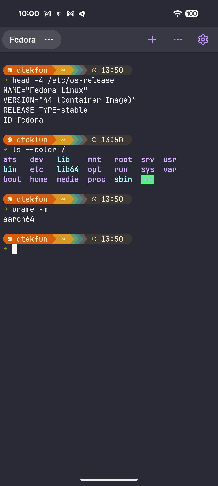
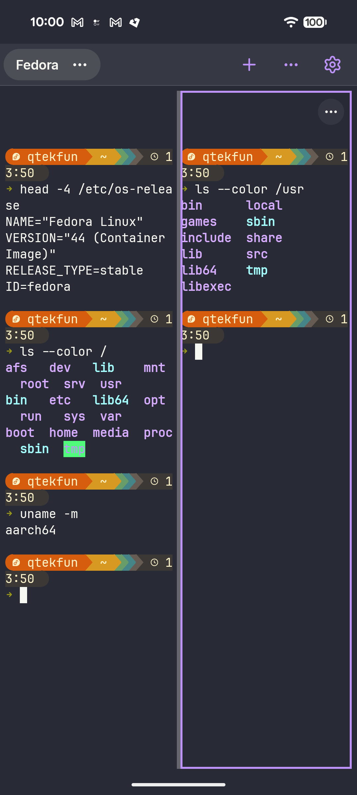
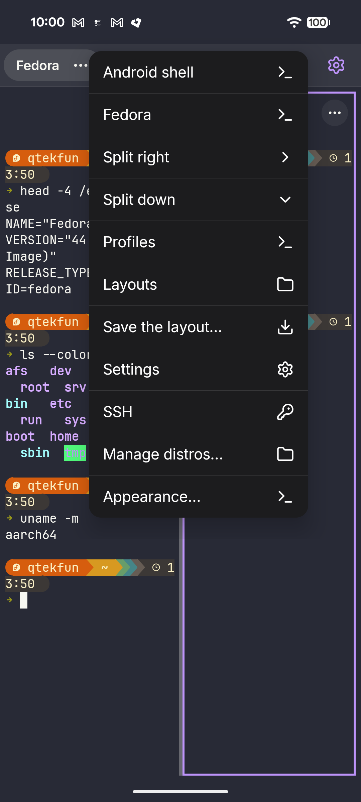

# UltimateTerminal

A modern terminal for Android that runs full Linux distributions (Debian, Ubuntu, Alpine, Fedora) through
[PRoot](https://github.com/proot-me/proot), a bit like WSL on Windows. It is inspired by
[Termux](https://github.com/termux/termux-app) and aims at a newer interface that fills the screen on
tablets and resizes with split screen, rotation and the keyboard. Terminal only: there is no graphical
environment. Free software ([GPL-3.0-or-later](LICENSE)), no Google services, no tracking.

> **Status: release `0.1.2`, early software.** Much of the code is tested only on a computer. It has
> been tried by hand on **two devices**: a Pixel 8 (Android 17) and a Huawei MRO-W09 tablet (Android 12).
> The tablet has only been used for the window-resize checks. Read [What is verified](#what-is-verified)
> before relying on anything.

<p align="center">
  
  
  
</p>

## What it does

Everything in this list is in the code and merged; see the next section for how far each part has
been checked.

- **Distributions:** install Debian, Ubuntu, Alpine or Fedora from their official mirrors, with the
  download checked by SHA-256, and open it in a tab (proot emulates root). List, rename, duplicate and
  delete them; pick a default one, which opens when the app starts, and change a distro's default user
  from its action sheet. Fedora comes as a `tar.xz` image and has no 32-bit ARM build.
- **First-run setup:** with no distro installed, the app opens a welcome screen instead of an Android
  shell: pick a distribution (Alpine, the smallest, is preselected), install it or restore a backup,
  and the first tab opens it. A small "skip" keeps the Android shell for that session only.
- **Non-root users:** a user you choose that does not exist in the distro is created automatically
  (no `su` needed), and the shell runs as that user.
- **Terminal:** a real PTY, 256-colour and true-colour emulation (Termux's emulator), scrollback,
  selection, pinch zoom, and a terminal that resizes with the window, the keyboard and rotation.
- **Tabs and panes:** several tabs, and split panes inside a tab. On wide windows the tab sidebar shrinks to a
  slim rail when you tap the terminal (tap the rail to open it again; Settings > Terminal turns this off).
  A long press on a tab asks to close it (not yet verified on a device).
  "+" opens a tab of the default distro; the three-dots button next to it opens the menu to choose a distro,
  split, open profiles and layouts, or go to Settings (a long press on "+" does the same).
- **Profiles, layouts and broadcast (Terminator-style):** named profiles (distro, user, scrollback,
  start-up command), saved pane layouts that reopen as a tab, typing in several panes at once with a
  red indicator, and shortcuts you can change. A profile's colour scheme, font and size are stored but not
  applied per pane yet.
- **Input:** an extra-keys row (Esc, Tab, Ctrl, Alt, arrows and more) that shows only while the on-screen
  keyboard is up, sticky Ctrl/Alt, hardware-keyboard shortcuts. Settings > Keyboard > "Keyboard type" picks
  what the soft keyboard is told the terminal is: Normal (default), Compatible (avoid autocorrect) or Raw.
  Normal is meant to stop some phones (Huawei, Xiaomi, OPPO and others) from showing their secure
  password keyboard in the terminal; this is addressed but not yet verified on such a phone.
- **SSH:** saved hosts that open a tab already running `ssh`, and SSH keys you can generate, import and
  export. Private keys are encrypted at rest with the Android Keystore.
- **Device files:** optional access to the shared storage from the distribution, under `~/storage`,
  for example to copy a log to Downloads. The storage permission is requested only when you turn it on.
- **Backups:** export one distribution, the settings, or everything to a file, optionally encrypted
  (AES-256-GCM, key derived from a password), and restore it on another device. Restoring adds the
  distributions without overwriting any you already have; the settings are replaced.
- **Appearance:** colour schemes (Solarized, Dracula, Gruvbox, Nord and more) that you can edit and
  import, light, dark and pure-black OLED themes, a bundled monospace font or a font file of your own,
  cursor shape, margins and tab bar style, and three styles for the extra keys (flat, capsule, classic).
- **Interface:** an iOS-style look (large titles, grouped lists, sheets, alerts) on the terminal chrome,
  Distros, Settings, SSH and Appearance, and a Settings screen with nine sections.
- **Exit:** the last entry of the "..." / "+" menu closes every session, stops the background service and its notification and closes the app (it asks first if something is still running).
- **Accessibility:** roles, actions for every gesture (select, move tab, move pane divider), 48 dp
  touch targets and large-font layouts were audited in the code; see below for what is not checked yet.
- **Languages:** English and Spanish.

## What is verified

"Host" means automated tests on a computer (JVM unit and integration tests and CI). "Device" means it
was run by hand: on a **Pixel 8** (Android 17, debug build) and, where stated, on a **Huawei MRO-W09
tablet** (Android 12, 2800x1840). Nothing was run on any other device.

| | Device | Host only |
|---|---|---|
| App starts; a tab with a real shell and PTY | yes (Pixel 8, tablet) | |
| Typing; the terminal shrinking above the keyboard (`stty size` matches what is drawn) | yes (Pixel 8, tablet) | |
| Text appearing as it is typed with the soft keyboard; extra-keys row following the keyboard | yes (Pixel 8) | |
| Foreground service keeping sessions alive | yes (it runs) | |
| Install Alpine from the app (download, SHA-256, extraction) and open it in a tab through proot | yes (Pixel 8) | |
| `apk add` over the network; `ssh`, `python3` and `nmap` in that tab; `free` and `uptime` | yes (Pixel 8) | |
| Install **Fedora** from the app (63 MB download, 195 MB extracted) and `dnf install` under proot | yes (Pixel 8) | |
| Starting the app opens the default distribution | yes (Pixel 8) | |
| First-run setup screen when there is no distro (install, restore, skip) | | yes (host tests only) |
| Non-root user created automatically (Alpine: `ops`, uid 1000, `/home/ops`; Fedora: prompt `[ops@localhost ~]$`) | yes (Pixel 8) | |
| New tab drawn at once and named after its distro | yes (Pixel 8) | |
| Split panes (right), focus border, the pane menu button in its own strip | yes (Pixel 8) | |
| Profiles: create, edit, open in a tab with its user and start-up command | yes (Pixel 8) | |
| Saved layouts: save two panes, list, reopen with the same users | yes (Pixel 8) | |
| Typing in all panes at once, with the red indicator | yes (Pixel 8) | |
| Editing a shortcut (the sheet opens and saves) | yes (Pixel 8) | |
| iOS-style Settings, Distros, "+" menu, alerts; Appearance preview and live scheme change | yes (Pixel 8) | |
| The three extra-key styles | yes (Pixel 8) | |
| Back button: leaves Settings pages, hides the keyboard in the terminal without typing anything | yes (Pixel 8) | Android 12 tablet: not verified |
| Resizing on a **tablet**: landscape and portrait, keyboard, a freeform window resized (PTY size matches what is drawn each time) | yes (tablet) | |
| Performance, debug build, Pixel 8, Fedora: cold start to prompt **1.63 s** median (1.48 to 1.65 s over five runs); `seq 1 200000` in **1.07 s** with a smooth interface | yes (Pixel 8) | |
| Performance, **release build** (`0.1.0-rc.2`, signed; the later releases were not timed again), Pixel 8, Alpine: cold start to prompt **about 1.2 s** median (1.17 to 1.24 s, measured by screenshots, so about ±0.25 s); first frame 0.12 to 0.23 s; `seq 1 200000` in **1.09 s**, 0 to 0.8 % janky frames | yes (Pixel 8) | Fedora not timed in release (heavier than Alpine) |
| Install Debian or Ubuntu | | yes (index and download logic; never run on a device) |
| Pinch zoom, selection gestures, tab reordering, hardware-keyboard shortcuts | | yes |
| Fonts of your own, OLED mode, schemes you edit | | yes (the preview and picking a built-in scheme were seen on the Pixel 8) |
| SSH hosts and keys with the real Keystore, running `ssh` to a real server | | yes (OpenSSH key format checked against the real `ssh-keygen` on a computer) |
| Backups: export and restore with the system file picker (the Settings page opens on the Pixel 8) | | yes |
| `~/storage` mount and its permission on Android 13 and later | | yes (an untested hypothesis, see `DECISIONS.md` D-T13-3) |
| Split-screen mode, split panes and a distro on the tablet | | yes (split screen fails with a system exception on this tablet's EMUI) |
| Instrumented tests (`docs/TESTING.md`: proot guest, backup round trip, activity launch) | | written and compiled; no run on a device is recorded yet |
| TalkBack, font scale 2.0, battery | | yes (accessibility fixes made from a code audit; the emulator throughput test runs on the host) |

Fixed in the code and not looked at on a device yet: the Back button on the Android 12 tablet (the
terminal view used to swallow it), the keyboard closing when Settings opens over the terminal, the
"Change user" action of the Distros list, the tab bar keeping the active tab fully visible, the
profile-named tabs, split panes inheriting their distro and user, the start-up command typed after the
first prompt, text fields focusing on a tap anywhere on the row, and the broadcast indicator in the
pane strip.

Every decision, and everything still to be validated, is written in [`DECISIONS.md`](DECISIONS.md).

## What is not there yet

Still pending, in this order of importance:

- TalkBack and the layouts at font scale 2.0 (and a release timing with Fedora: the release timing above is Alpine).
- Split-screen on the tablet, split panes and an installed distro on the tablet.
- Backup export and restore with the system file picker, and the SSH and `~/storage` flows, on a device.
- F-Droid publication: sending the recipe to fdroiddata (it is ready and passes `fdroid lint`; the screenshots are in `fastlane`, taken on a Pixel 8 with `0.1.2`).

Backups are gzip-compressed rather than `.tar.zst` as the spec first asked, because the Zstandard
libraries for Java ship precompiled binaries that F-Droid does not accept. The full list and the order
are in [`PLAN.md`](PLAN.md) and [`SPEC.md`](SPEC.md).

Known limits of running on Android: from Android 12 the system may kill the child processes of an app
even when it keeps a foreground service (the "phantom process killer", which caps them at about 32), so a
long session with many programs can be cut short. There is no mitigation in the app yet; see
`DECISIONS.md` (D-T08-5) for the developer-options workaround and the details. Inside proot some `/proc`
files are denied by SELinux, so `top` and `htop` rely on approximate fake files. A non-root user keeps
the extra Android groups that proot inherits.

## FAQ: where are my files? Why are distros in private storage?

Distros live in the app's private storage, not on the sdcard or in a shared folder. Shared storage has no
symbolic links, no Unix permissions or owners and no executable bit, and it is mounted `noexec`, so a Linux
root filesystem (and proot) cannot work there; it is also readable by other apps, and Android 11 and later
block apps from using it like that anyway. To get your files out:

- **Backups:** Settings > Backups > Export saves one `.utbackup` file wherever you choose with the system
  file picker (Downloads, a USB drive, a cloud folder), named `UltimateTerminal-<date>.utbackup`. Copy it to
  a computer or a USB stick; on a new device, restore it from the first-run screen or from Settings >
  Backups (it asks for the password if you set one).
- **`~/storage`:** with "Device storage" turned on in Settings, the phone's shared storage is mounted inside
  every distro at `~/storage`; `cp report.pdf ~/storage/downloads/` puts the file in your Downloads folder.

## Why not Google Play

To run programs from its own storage the app targets Android 9 (API 28, `targetSdk 28`): from API 29
Android forbids executing binaries from an app's private storage, and proot needs it. Google Play
no longer accepts apps that target an API that old, so the app is meant for F-Droid and GitHub
Releases. `minSdk` is 26.

## Building

You need JDK 21, the Android SDK (`compileSdk` 37), the NDK `28.2.13676358` and CMake `3.31.6`. proot is
compiled from source as part of the build, so clone with the submodules:

```
git clone --recurse-submodules https://github.com/qtekfun/UltimateTerminal.git
cd UltimateTerminal
./gradlew assembleDebug     # debug APK in app/build/outputs/apk/debug/
./gradlew check             # everything CI runs: tests, detekt, ktlint, Lint, coverage rules
```

Releases, signing and the F-Droid recipe are described in [`RELEASING.md`](RELEASING.md). To contribute,
read [`CONTRIBUTING.md`](CONTRIBUTING.md). What the app does with your data and why it asks for each
permission is in [`PRIVACY.md`](PRIVACY.md).

## Credits and license

UltimateTerminal is licensed under the **GPL-3.0-or-later**. It builds on the work of others, each with
its own license, listed in [`THIRD_PARTY_NOTICES.md`](THIRD_PARTY_NOTICES.md). Among them:

- the terminal emulator library of [Termux](https://github.com/termux/termux-app) (Apache-2.0 for that
  library, itself derived from Android Terminal Emulator by Jack Palevich), included unmodified;
- [PRoot](https://github.com/proot-me/proot) (GPL-2.0-or-later) and [talloc](https://talloc.samba.org/)
  (LGPL-3.0-or-later), built from source;
- the fonts JetBrains Mono and Inter (SIL OFL 1.1), the Lucide icons (ISC) and the colour schemes
  Solarized, Dracula, Gruvbox and Nord (MIT).

The Linux distributions are downloaded by your device from their official mirrors and are not part of
this repository or of the APK. This is an independent project: it is **not affiliated with, endorsed by
or sponsored by** Termux, Debian, Ubuntu, Alpine Linux, Apple or any other project named here.
